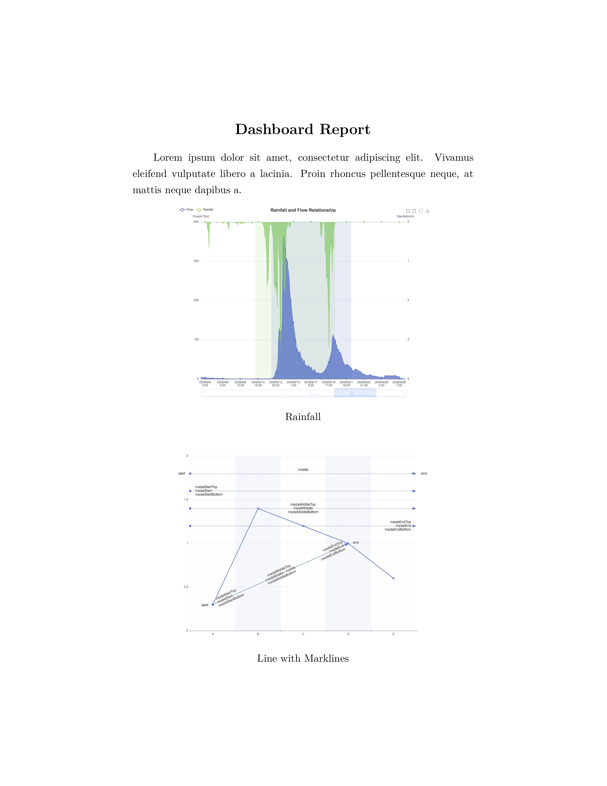
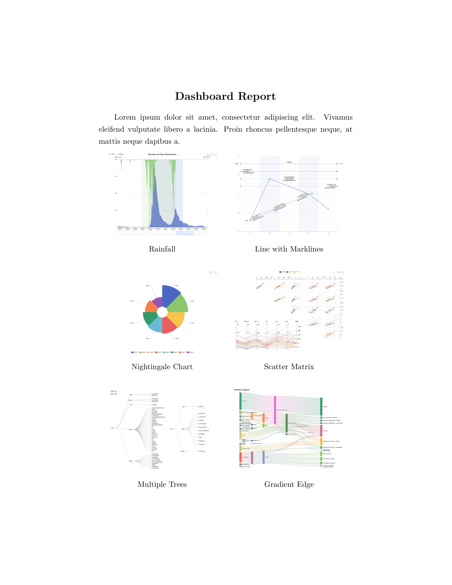

[](https://circleci.com/gh/shaochuancs/dashboard-typesetter/tree/master)

# DashboardTypesetter

An Out-of-the-Box typesetting tool for dashboard. With chart data of dashboard, DashboardTypesetter can generate PDF automatically, in publishing quality.

## Run in Docker

The easiest way to run DashboardTypesetter is through Docker image:

`docker run -d -p 3000:3000 shaochuancs/dashboard-typesetter`

This image has a minimal [TeX Live](https://tug.org/texlive/) embedded, so you don't need to install anything else.

## Run in server

You can also run DashboardTypesetter from release code.

1. Run `git clone https://github.com/shaochuancs/dashboard-typesetter-release.git`, or download [release package](https://github.com/shaochuancs/dashboard-typesetter-release/releases).
2. Run `npm install`. This will take a few minutes, be patient.
3. Install [TeX Live](https://tug.org/texlive/) on server (if not yet)
4. Run `npm start` to launch the server.

## API

| URL     | HTTP Method | HTTP Content-Type | Description                                       |
|---------|-------------|-------------------|---------------------------------------------------|
| /export | POST        | application/json  | Send dashboard data, and get generated PDF. |

Please refer to [Swagger API document](https://app.swaggerhub.com/apis-docs/shaochuancs/DashboardTypesetter/1.0.1) for detail description.

## Example

### Basic example

You can send POST request to DashboardTypesetter server, with title (optional), description (optional) and dashboard data (required), in following JSON format:

```
{
    "title": "Your dashboard title",
    "description": "The description of your dashboard",
    "dashboard": {
        "charts": [{
            "library": "echarts",
            "data": {
                "option": {
                    // The option of this ECharts chart
                    ...
                }
            },
            "metadata": {
                "title": "The title of this chart"
            }
        }, {  
            // Another chart
            ...
        }, ...]
    }
}
```

DashboardTypesetter server will parse this JSON and generate PDF. Here is the first page of an example PDF:



### Two columns layout

Sometimes you may want to generate PDF with two columns layout. You can declare `layout` field as `two_columns` in `dashboard`, in JSON, to generate expected PDF:

```
{
    "title": "Your dashboard title",
    "description": "The description of your dashboard",
    "dashboard": {
        "layout": "two_columns",
        "charts": [{
            "library": "echarts",
            "data": {
                "option": {
                    // The option of this ECharts chart
                    ...
                }
            },
            "metadata": {
                "title": "The title of this chart"
            }
        }, {  
            // Another chart
            ...
        }, ...]
    }
}
```

Here is the first page of an example two columns PDF:



## Chart library support

DashboardTypesetter support following chart library:
* ECharts

## Customization Service
I'm also providing customization service on dashboard/chart typesetting, please contact shaochuancs@gmail.com if you are interested.

## License
(The Private License for DashboardTypesetter)

Copyright (c) 2021-2022 Chuan Shao &lt;shaochuancs@gmail.com&gt;
